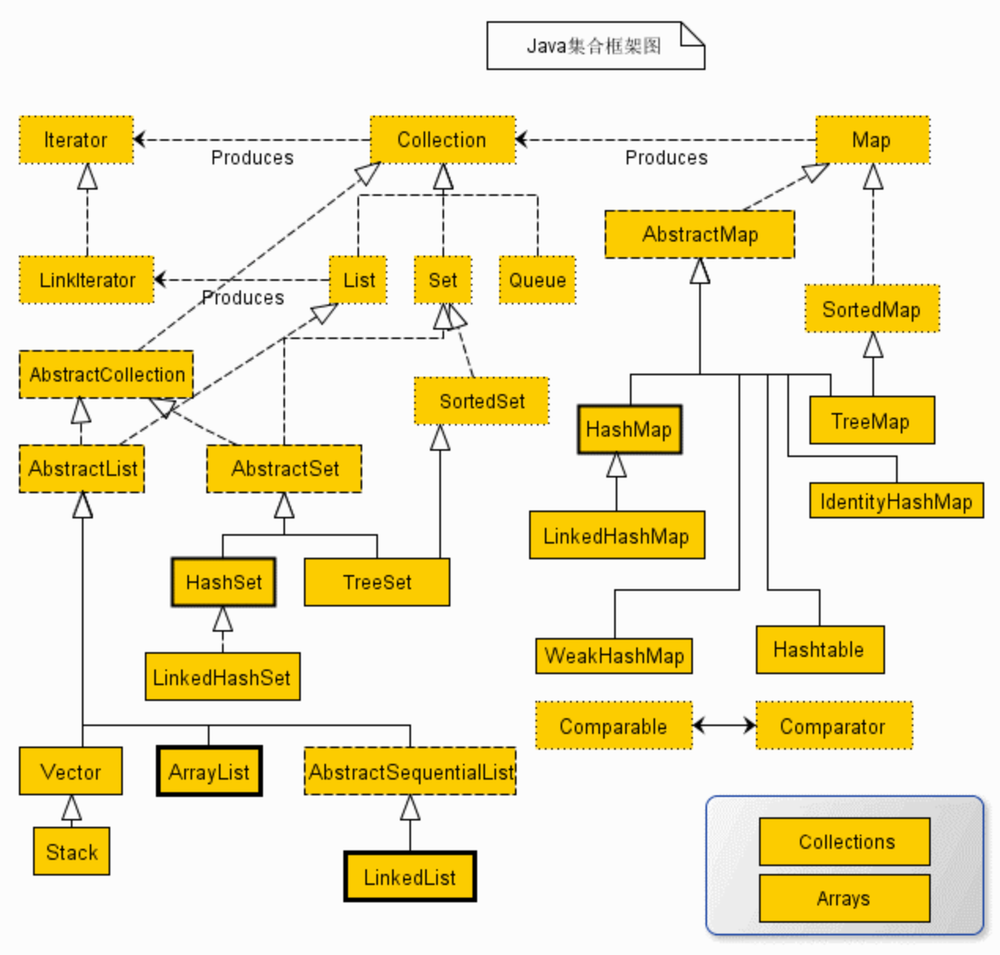

# 集合框架

所有编程语言都离不开对数据的存储，程序的运行离不开数据的存储与传递，每种语言都对不同的数据结构提供了支持。在Java中提供了不同的类来支持不同数据存储的实现。

Java中将集合类库的接口与实现分离，接口并没有说明这种数据结构是如何实现的，而是交给实现类来实现数据结构是如何组成的。

## Iterable&Collection

### Iterable

迭代器是Java集合框架顶级接口，任何集合都间接继承了此接口并实现了迭代自身的方法。

#### 内部方法

- 返回一个自身类型的迭代器：`iterator() return Iterator<T>`
- 对内部元素进行遍历**Java1.8新增**：`default forEach(Consumer<? super T> action) return void`
- 在并行下进行遍历**Java1.8新增**：`default spliterator() return Spliterator<T>` ***尚未了解*** 

### Collection

Collection是所有单列集的父类接口，其子类包括List、Set等。集合本身不能存放四类八种基本数据类型，因为集合中存储的都是引用数据类型，而其真实的值都在堆内存或方法区中，但是基本数据类型都存放在栈内存中，随时都会被回收。可以通过基本类型对应的包装类来使集合存储包装过的基本数据类型，在**Java1.5**中引入自动拆装箱的机制方便了集合对基本数据类型的存储。

#### 内部方法

- 返回内部元素个数：`size() return int`
- 向集合内添加元素：`add(Object o) return boolean`
- 向集合内添加另一个集合：`addAll(Collection c) return boolean`
- 清空集合：`clear() return void`
- 判断是否存在某一个对象：`contains(Object obj) return boolean`
- 判断集合中是否存在另一个集合中所有元素：`containsAll(Conllection c) return boolean`
- 判断集合是否为空：`isEmpty() return boolean`
- 移除一个元素：`remove(Object obj) return boolean`

## Iterator

## Java集合框架类图

## List

List是有序集合的顶层接口，List中的元素可以重复并且其存储数据的顺序也是固定的。

### ArrayList

可以把ArrayList理解成一个可变数组，可以通过下标访问集合中的元素。所以ArrayList的查询速度很快，直接通过索引即可得到元素。但是增加和删除非常慢，每次增加和删除都要根据当前集合长度而调整集合的存储空间，甚至删除元素还会多次拷贝数组。

#### 内部方法

- 

### LinkedList

LinkedList底层是双向链表，集合中的每一个元素都存储了上一个元素和下一个元素的地址。相较于ArrayList其增加和删除元素的速度快很多，每增加一个元素时，会将相邻的两个元素的地址保存在元素的头尾，而将自身的地址交给相邻元素的头尾便完成了增加。删除时只需将相邻元素的地址指向对方便完成了删除。而查询速度却很慢，每次查找元素都相当于在遍历整个集合。

#### 内部方法

- 向头部添加元素：`addFirst(Object obj) return void`
- 向尾部添加元素：`addLast(Object obj) return void`
- 返回头部元素：`getFirst() return Object`
- 返回尾部元素：`getLast() return Object`
- 删除并返回头部元素：`removeFirst() return Object`
- 删除并返回尾部元素：`removeLast() return Object`

### ArrayDeque

ArrayDeque双端队列，源码有被transient修饰的Object数组，当调用构造函数时就会初始化这个数组给定长度为16。ArrayDeque有分为头和尾，在概念上头和尾组成一个连续的数组，但是实际上头和尾是两个部分，ArrayDeque内部总是存在一段空闲空间，他要保证头和尾不会相撞。

## Set

Set是无序集合的顶层接口，Set中的元素不可以重复并且其存储数据的位置不固定，在遍历时每次组成的顺序都是随机的。

### HashSet

#### LinkedHashSet

### TreeSet

## Map

### HashMap

### TreeMap

### WeakHashMap

### IdentityHashMap

