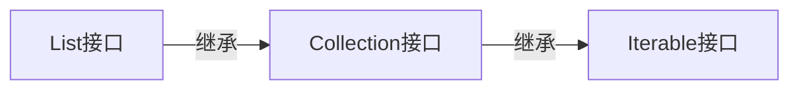

# 集合框架

所有编程语言都离不开对数据的存储，程序的运行离不开数据的存储与传递，每种语言都对不同的数据结构提供了支持。在Java中提供了不同的类来支持不同数据存储的实现。

Java中将集合类库的接口与实现分离，接口并没有说明这种数据结构是如何实现的，而是交给实现类来实现数据结构是如何组成的。

## `Iterable`&`Collection`

### `Iterable`

迭代器是Java集合框架顶级接口，任何集合都间接继承了此接口并实现了迭代自身的方法。

#### 内部方法

- 返回一个自身类型的迭代器：`iterator() return Iterator<T>`
- 对内部元素进行遍历**Java1.8新增**：`default forEach(Consumer<? super T> action) return void`
- 在并行下进行遍历**Java1.8新增**：`default spliterator() return Spliterator<T>` ***尚未了解*** 

### `Collection`

`Collection`是所有集合接口的父类，其子类包括`List`、`Set`、`Map`等。集合本身不能存放四类八种基本数据类型，因为集合中存储的都是引用数据类型，而其真实的值都在堆内存或方法区中，但是基本数据类型都存放在栈内存中，随时都会被回收。可以通过基本类型对应的包装类来使集合存储包装过的基本数据类型，在**Java1.5**中引入自动拆装箱的机制方便了集合对基本数据类型的存储。

#### 内部方法

- 返回内部元素个数：`size() return int`
- 向集合内添加元素：`add(Object o) return boolean`
- 向集合内添加另一个集合：`addAll(Collection c) return boolean`
- 清空集合：`clear() return void`
- 判断是否存在某一个对象：`contains(Object obj) return boolean`
- 判断集合中是否存在另一个集合中所有元素：`containsAll(Conllection c) return boolean`
- 判断集合是否为空：`isEmpty() return boolean`
- 移除一个元素：`remove(Object obj) return boolean`

## `Iterator`

## `List`

#### `List`类关系

### `ArrayList`

### `LinkedList`

## `Set`

### `HashSet`

#### `LinkedHashSet`

### `TreeSet`

## `Map`

### `HashMap`

### `TreeMap`

### `WeakHashMap`

### `IdentityHashMap`

