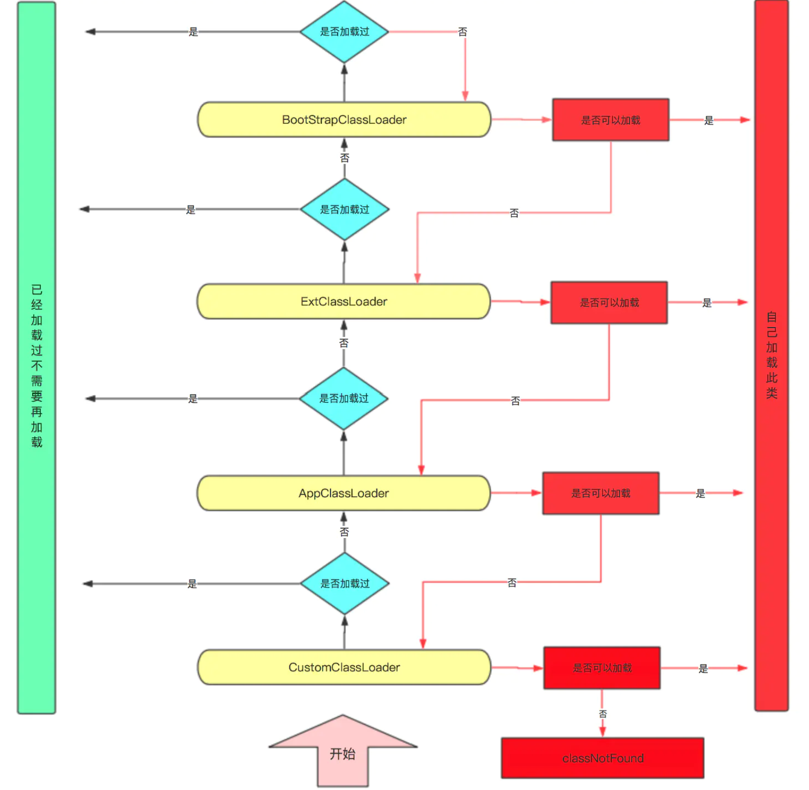

# 面向对象

**在Java中万事万物皆对象**

Java是完全面向对象语言，类是java的基本单位，类也是一个对象，所有的操作都需要在类中实现。面向对象有三个最基本的概念：封装、继承、多态。

## 类

在Java中类是一种复杂数据类型，也是Java程序的基本单位。当类实例化为对象时在内存中会存在存放类的空间，可以通过类提供的方法对类进行操作。**类的实例不是一定在堆上**

### 类的加载、链接、初始化

**加载**：当程序需要使用某一个类时会根据全限定类名使用二进制流的方式加载到JVM内存的方法区，然后转换为一个java.lang.Class实例。

**链接**：链接阶段包含了三个步骤

1. 验证：验证阶段是对文件以及代码分析，是否是一个有效的字节码文件，是否符合Java本身的语言规范例如被final修饰的方法被子类重写等。
2. 准备：为静态变量分配方法区内存并初始化赋值。
3. 解析：解析 主要将常量池中的符号引用替换为直接引用的过程。***待了解***

**初始化**：初始化才是程序代码执行的开始，由不同的虚拟机实现来运行Java代码。

### 类加载过程中成员变量的初始化顺序

1.父类静态成员和静态初始化快，按在代码中出现的顺序依次执行。

2.子类静态成员和静态初始化块，按在代码中出现的顺序依次执行。

3.父类的成员变量和实例初始化块，按在代码中出现的顺序依次执行。

4.执行父类的构造方法。

5.子类成员变量和实例初始化块，按在代码中出现的顺序依次执行。

6.执行子类的构造方法。

初始化顺序可简记为：父静态->子静态->父成员变量->父构造–>子成员变量->子构造

### 类加载器

Java程序是运行在JVM虚拟机中，每当启动Java程序时一定通过JVM来运行。

- BootstrapClassLoader：负责加载JDK库文件JAVA_HOME/lib，此类并不继承Java.lang.CLassLoder，不能被程序调用。
- ExtClassLoader：负责加载扩展类JAVA_HOME/lib/ext， 或由系统变量java.ext.dir指定的文件夹，可以被程序员调用是AppClassLoader的父类。
- AppClassLoader：应用程序加载器，默认我们编写的程序都是由此类加载。

#### 双亲委派机制



每当JVM需要加载一个类时，总是由当前类加载器的父类来加载类，父类若没有加载才会由自己加载这个类。使用双亲委派机制的好处是对类的管理。

通过按照层级委派来检查类是否被加载过，防止一个类被重复加载以及防止加载被修改过已加载的类。

#### 自己实现类加载器

```java
public class MyClassLoader extends java.lang.ClassLoader{
    // 设置需要加载类的读取路径
    private String classPath;
    // 构造函数设置路径
    public MyClassLoad(String classPath) {
        this.classPath = classPath;
    }
    // 类加载器的核心
    @Override
    protected Class<?> findClass(String className) {
        
        Class clazz = null;
        // 获取.class的字节数组
        byte[] byte = getClassByte();
        
        if (byte != null) {
            // defineClass将字节数组转换为Class
            clazz = defineClass(className, byte, 0, byte.length);
        }
        return clazz;
    }
    // 将.class文件读取为字节数组
    private byte[] getClassByte() throws Exception {
        
        File file = new File(classPath);
        FileInputStream inputStream = new FileInputStream(file);
        // 字节数组缓冲区
        ByteArrayOutputStream outputStream = new ByteArrayOutputStream();
        
        byte[] bytes = new byte[1024];
        int len = -1;
        
        while ((len = inputStream.read(bytes) != -1)) {
            outputStream.write(bytes, 0, len);
        }
        inputStream.close();
        // 将字节数组缓冲区转换为一个字节数组并返回
        return outputStream.toByteArray();
    }
}
```

### 封装、继承、多态

#### 封装

封装，即隐藏对象的属性和实现细节，仅对外提供接口。当需要实现一项功能时，仅需调用类提供的公开方法即可不必理会类内部的具体实现。

Java实现封装所采用的是**权限修饰符**

| 修饰符                       | 描述               | 权限                               |
| ---------------------------- | ------------------ | ---------------------------------- |
| public                       | 公开的             | 可以被任何类访问                   |
| protected                    | 受保护的           | 本类、本包子类以及其他包的子类可见 |
| 空                           | 默认的不填写修饰符 | 只在本类以及本包子类可见           |
| private                      | 私有的             | 仅本类可见                         |
| 接口中的default**Java8新增** | 默认的             | 只在本类以及本包子类可见           |

#### 继承

继承是代码复用的一个重要能力，通过继承可以减少非常多的代码量。

继承中通常把被继承的类称为父类或者超类，继承的类被称为子类或者派生类。即便没有显示的声明类的父类那么它继承自Object类。

Java支持多重继承不支持多继承。多重继承是指子类的父类还有一个父类或者父类的子类还有一个子类，依此类推。典型的理解就是Object方法在所有类中都可以使用，无论是继承了其他类的子类还是没有表明明确的继承关系的新建类都继承了Object类中方法，这就是多重继承。多继承是指子类在继承时继承多个父类，Java并不支持这种做法，为了解决多继承的方法决议问题Java摒弃了C++的多继承。

子类无法继承父类的私有域和私有方法。**通过反射证明**

##### 构造器

每一个普通类中都存在这一个或多个实例化类的构造器，如果没有显示的书写任何构造器，在实例化类的时候会自动添加一个不需要传入参数的构造器(无参构造)

如果父类中只有有参数的构造器，那么在子类构造器中必须显示调用父类的某个构造器。

##### 方法的重写和重载

- 重写：在继承关系中，父类方法的实现不足以满足子类的需求时，可以采用方法的重写，首先其权限修饰符必须不能小于父类的修饰符，其次其返回值与形参不能修改必须与父类的相同
- 重载：在同一类中，需要使用相同的方法名做不同的实现，可以采用方法的重载，可以采用不同的修饰符，并且形参必须不同

##### 抽象类

**抽象类无法实例化**，抽象类使用abstract修饰，抽象类可以同普通类一样设置域，设置有实现的方法。唯一不同的就是抽象类中含有抽象方法。

如果一个类包含抽象方法，那么这个类必须是抽象类。

任何抽象类的子类必须重写父类中的抽象方法，否则该类同样是抽象类。

##### 接口

**接口无法实例化没有构造方法**为了支持多继承Java引入接口的概念，一个类可以实现多个接口在实现多个接口时使用 ，号分割。接口中的方法默认是public abstract修饰或者显示的声明static修饰的静态方法，内部域默认是public static final修饰。

在Java8之前，接口中所有方法都是抽象方法，而在Java8之后接口中可以存在使用default修饰的默认实现方法，并且使用default修饰的方法只能在接口中存在。Java9之后，接口中可以拥有private修饰的私有方法。

本质上接口不是被类继承了，而是被类实现，接口只能继承接口。当子类实现了一个接口必须把所有抽象方法都实现，否则子类是一个抽象类。

###### 解决默认方法冲突

当在一个实现类中继承了一个超类并实现了另一个接口，接口中的默认方法与超类中的方法完全冲突（方法名、返回值、参数列表），Java会采取超类优先的原则默认忽略接口中的方法。

当在实现类实现了多个接口并且接口与接口的某个默认方法完全冲突时并且有一个为默认方法提供实现时，Java要求实现类必须重新实现这个方法。

#### 多态

**多态的前提**

- 继承关系
- 子类重写父类方法
- 向上转型

##### JVM方法区中的类信息

通过类加载器载入JVM的类都会在JVM的方法区存储该类定义的所有信息，包括方法代码、类变量、成员变量、以及**方法表**。一个类在方法区中的类信息只有一个实例，被各个线程共享。

类信息包含以下信息：

- 类型信息：类的修饰符、类的全限定类名、类的父类全限定类名、类的实现接口有序列表
- 类型的常量池（静态常量池）：字面量如String类型数据、final修饰的基本类型，符号引用
- 域信息：声明顺序、修饰符、类型、名字
- 方法信息：声明顺序、修饰符、返回值类型、名字、参数列表（有序保存）、异常表、方法字节码、操作数栈和局部变量大小
- 静态变量
- 对类加载器的引用：双亲委派机制使用这个引用来确定到底是那个类加载器加载了此类
- 对Class类的引用：当使用new创建一个新的类实例后，为了确定类的具体类型必须知道新实例的来源
- 方法表

##### 静态绑定与动态绑定

静态绑定在类加载阶段就已经确定了类中方法属于哪一个类，而动态绑定则是在程序运行期间根据不同的引用来确定被调用的方法要使用具体的哪一个类中的方法，在Java中默认实现动态绑定。

动态绑定依靠存储于JVM方法区的方法表来完成动态绑定，使用private修饰的方法会在类加载过程就实现静态绑定，因为其不会被子类继承。

##### 多态实现的原理

```java
class SuperClass {
    int a;
    
    public void run() {
        
    }
}
class ThisClass extends SuperClass {
    int b;
    
    public ThisCLass(int a, int b) {
        this.a = a;
        this.b = b;
    }
    
    @Overiide
    public void run() {
        System.out.println("Hellow Word!");
    }
}

class Run{
	public static main(String[] args) {
        
        SuperClass newClass = new ThisClass(23, 12);
        
        newClass.run();
        System.out.println("a = " + newClass.a);
        // System.out.println("b = " + newClass.b); error, 超类中并没有成员变量b 
    }    
}

// Out:Hellow Word!
// Out:a = 23
```

当利用多态进行创建对象时，会根据双亲委派机制加载父类和子类的class文件，在栈内存中分配父类的引用在堆内存中根据子类的不同构造器创建子类的实例，并将本实例的地址赋给父类的引用，被向上转型的子类仍然保存着指向方法区的类信息。当调用方法时，会根据父类的方法表查找有没有这个方法，然后调用子类中具体实现的方法。

## 反射

### Class类

每个被加载的类都会生成相应的类型信息，通过获取类的Class对象，可以通过逆向操作来对一个类执行操作。

具体的类型信息保存在JVM的方法区，类加载器每加载一个Class文件都会在方法区创建一个Class实例。每一个Class实例都保存了Class的全部信息，并且Class实例的大小是在解释期间就完全确定的。每个在堆内存创建的实例都会存储指向方法区Class类信息的引用，虚拟机需要明确知道每一个被创建的实例到底是什么类型的，

### Method类

### Field类

### Constructor类


